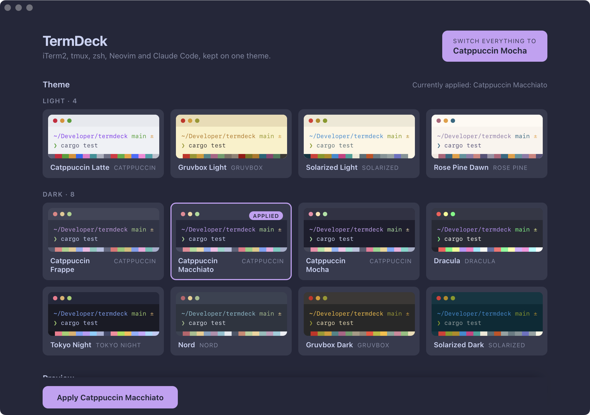
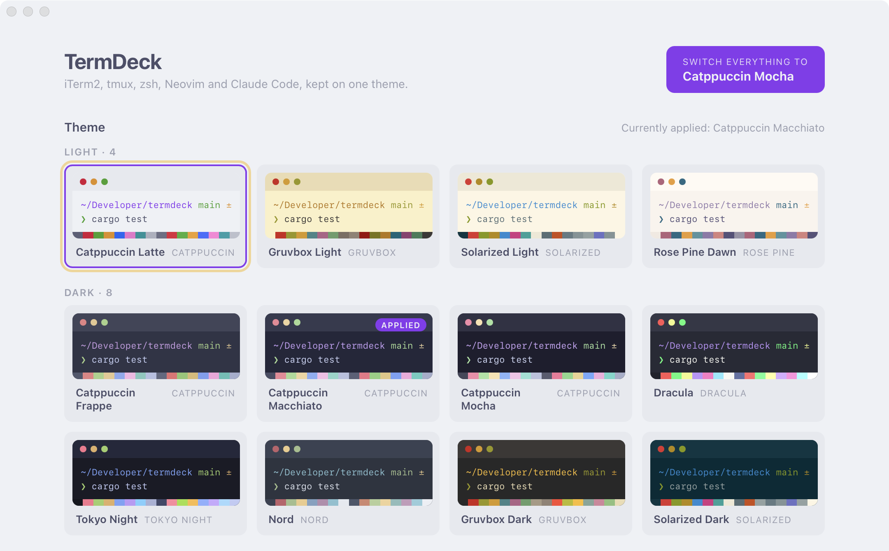
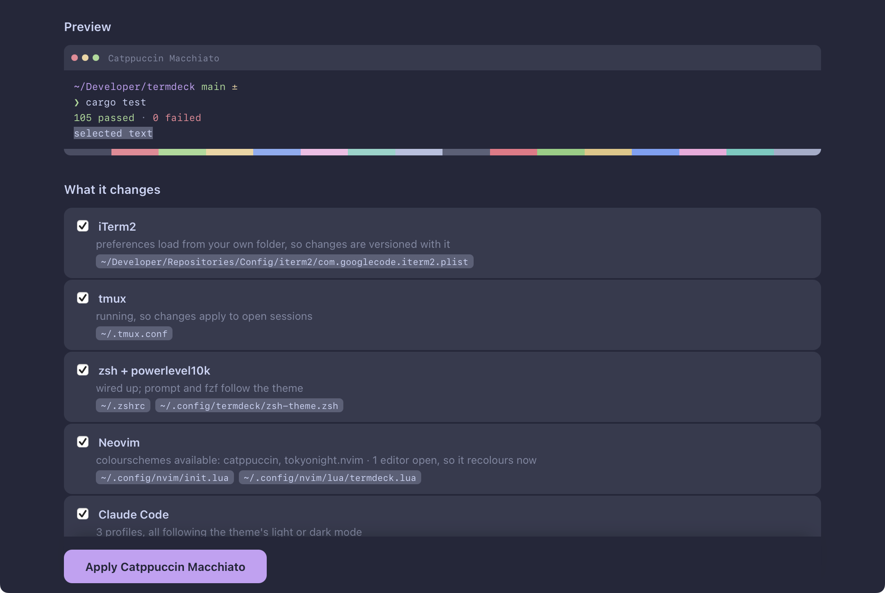

<div align="center">


# TermDeck

### One toggle. Five tools. One theme.

**iTerm2 · tmux · zsh · Neovim · Claude Code** — recoloured together, in a single click.

[](https://www.rust-lang.org)
[](https://tauri.app)
[](https://react.dev)
[](https://www.typescriptlang.org)


<br>



</div>

---

## The problem

Changing your terminal theme by hand means editing five different things in five
different formats. Forgetting one of them is what makes the result look wrong —
a Mocha terminal with a Latte prompt, or a Neovim that never got the memo.

TermDeck does all five together, and tells you honestly which ones took effect
immediately and which need a nudge.

<div align="center">

<p><em>The window wears whichever theme you are previewing, so you see the result rather than a description of it.</em></p>
</div>

## What it changes

| Target | File | How it applies |
| --- | --- | --- |
| **iTerm2** | a dynamic profile, plus the preferences plist when iTerm2 is closed | AppleScript recolours every open session immediately; the dynamic profile is what makes it persist |
| **tmux** | `~/.tmux.conf` | the catppuccin plugin's flavour, or an explicit status line for other themes, then `tmux source-file` |
| **zsh** | `~/.config/termdeck/zsh-theme.zsh`, plus one line in `~/.zshrc` | powerlevel10k prompt colours and the fzf palette |
| **Neovim** | `~/.config/nvim/lua/termdeck.lua`, plus one line in `init.lua` | `background` and `colorscheme`; open editors are recoloured over their own socket |
| **Claude Code** | `settings.json` in every `~/.claude*` profile | the theme's light or dark mode |

Claude Code has no palette to configure, so a theme only decides whether it runs
light or dark. Tick **"Make Claude Code use the terminal's own palette"** and it
switches to `light-ansi` / `dark-ansi` instead, which draws with the same
sixteen ANSI colours TermDeck just set — so it matches exactly rather than
approximately.

<div align="center">

<p><em>Every target lists the exact files it will touch, and what TermDeck detected about it.</em></p>
</div>

## Themes

Twelve themes, each carrying a full sixteen-slot ANSI palette rather than just a
background colour.

| Light | Dark |
| --- | --- |
| Catppuccin Latte | Catppuccin Frappé · Macchiato · Mocha |
| Gruvbox Light | Dracula |
| Solarized Light | Tokyo Night |
| Rosé Pine Dawn | Nord |
| | Gruvbox Dark |
| | Solarized Dark |

Neovim colourschemes come from plugins, so a theme also names the plugin that
provides its colourscheme. When that plugin is not installed, TermDeck picks the
nearest catppuccin flavour of the same lightness instead and says so in the
result, rather than asking Neovim for a colourscheme that does not exist. With
only `catppuccin` and `tokyonight.nvim` installed — the usual LazyVim starting
point — six of the twelve themes match exactly and the rest substitute.

The toggle switches between one light and one dark theme, both of which you
pick. It defaults to Latte and Mocha.

## Why it is built this way

**A Rust core that never opens a window.** All the logic — the theme model, the
five adapters, the file editing — lives in `crates/core` with no Tauri
dependency at all. That is what makes it testable: `cargo test -p termdeck-core`
runs **161 tests**, including one that applies themes to a throwaway home
directory and one that round-trips a real iTerm2 binary preferences file.

**Because editing someone's dotfiles is not a job for an append-only shell
script.** A script that appends is a script that eventually leaves you with
fifty stacked blocks and a `.zshrc` nobody wants to open. TermDeck rewrites its
own block in place, and the tests exist mostly to enforce that.

**Native, not Electron.** Tauri 2 with a React 19 front end: a **10 MB** app and
a 2.9 MB installer, against the 100 MB+ a Chromium runtime would cost.

**No accounts, no telemetry, no updater.** TermDeck's own code speaks to nothing
but your filesystem: the core crate depends on `serde`, `plist` and `dirs`, the
front end makes no `fetch` calls, and the webview runs under a `default-src
'self'` policy. It reads and writes files on your machine and does nothing else.

## Getting started

Requires Rust, Node 20+, and pnpm.

```bash
pnpm install
pnpm app          # development
pnpm app:build    # produces TermDeck.app and a .dmg in target/release/bundle
```

One-time step for iTerm2: open Settings → Profiles, select **TermDeck**, then
Other Actions → **Set as Default**. After that, every theme change reaches new
windows on its own. Until you do it, the app keeps saying so.

To see what it would do without letting it near a real dotfile:

```bash
cargo run -p termdeck-core --example dryrun -- catppuccin-mocha
```

## How it edits your files

Two rules hold everywhere, and the tests are mostly about enforcing them.

**Every file is backed up before the first write.** The first copy of anything
is kept forever as `~/.config/termdeck/backups/<file>.original`, so there is
always a way back to what existed before TermDeck ran at all. Later copies are
dated, and the ten most recent are kept.

**TermDeck only owns the text between its own markers.** Changes go into blocks
like this, and everything outside them is left exactly as it was:

```
# >>> termdeck:tmux-flavour >>>  managed by TermDeck — edits here are overwritten
set -g @catppuccin_flavour 'mocha'
# <<< termdeck:tmux-flavour <<<
```

Re-applying rewrites the block rather than appending a second one, so switching
themes fifty times leaves the file the same length it was after the first.
Toggling away and back is byte-for-byte lossless, which `tests/end_to_end.rs`
checks by doing exactly that.

Placement matters and is not incidental. The tmux flavour is written *before*
the line that runs the plugin manager, because that is when the catppuccin
plugin reads it. Themes with no catppuccin flavour get a second block *after*
that line, since anything meant to override a plugin has to come after it. The
zsh block goes at the end of `.zshrc`, after `~/.p10k.zsh` is sourced, because
the last assignment to a `POWERLEVEL9K_*` variable is the one the prompt uses.
The Neovim block goes at the end of `init.lua`, after `require("config.lazy")`,
because lazy.nvim loads plugins synchronously during that call and LazyVim sets
its own colourscheme while it does — running earlier would just be overwritten.

Blocks are commented the way their file expects: `#` for tmux and zsh, `--` for
Lua. A `#` in `init.lua` is a syntax error, so Neovim would fail to start rather
than merely look wrong. Finding a block matches on the marker text alone, so the
comment style only affects writing.

## What "applied" and "pending" mean

Some of this is visible instantly and some genuinely is not, so the app
distinguishes them rather than saying "done" to everything:

- **iTerm2** recolours open sessions immediately, and writes a managed profile
  that new windows read — once the TermDeck profile is your default.
- **tmux** reloads open sessions right away.
- **Neovim** recolours editors that are already open, over the socket every
  instance has listened on since 0.10. If none are running it applies at next
  launch.
- **zsh** cannot be reached from outside a running shell. Open a new one, or run
  `source ~/.config/termdeck/zsh-theme.zsh`.
- **Claude Code** reads its theme at startup, so restart a running session.

## Layout

```
crates/core/     the theme model and the five adapters — no Tauri, fully tested
src-tauri/       a thin Tauri command layer over the above
src/             the React interface
```

The logic lives in `crates/core` precisely so it can be tested without a window.

## Three things about iTerm2 that cost real time

These are all cases where the obvious approach looks right, appears to work, and
does not.

**The preferences plist cannot be written while iTerm2 is running.** iTerm2
holds preferences in memory the whole time it runs and writes them back out on
quit, so an edit made underneath it is discarded when it exits. The theme seems
to persist and then quietly does not. TermDeck writes the plist only when iTerm2
is closed, and relies on a dynamic profile otherwise.

**A dynamic profile must copy, not inherit.** `Dynamic Profile Parent Name`
looks like the clean way to keep the user's font and keybindings while
overriding colours. For colours it does the opposite of what you would expect:
the parent's win over the child's, so an inheriting profile shows the parent's
palette and the theme never appears. TermDeck copies the default profile's
settings instead and overwrites the colours.

**"Use Separate Colors for Light and Dark Mode" silently discards your
palette.** With that switch on, iTerm2 ignores `Background Color` entirely and
reads `Background Color (Light)` or `Background Color (Dark)` depending on the
system appearance. Writing the plain keys does nothing at all. TermDeck writes
every colour to all three keys and turns the switch off, so a theme means one
appearance regardless of what macOS is set to.

## Notes

powerlevel10k takes 256-colour palette indices rather than truecolor hex, so
prompt colours are mapped to the nearest palette entry on the way out. fzf gets
exact hex. Indices 0-15 are excluded from that mapping on purpose: those are the
ANSI slots TermDeck is also rewriting, so matching against them would make the
prompt colour depend on the palette it sits on.

An app launched from the Finder does not inherit the `PATH` a terminal has — on
a typical machine a GUI process starts without Homebrew on it. Everything that
shells out goes through `which.rs`, which searches the usual install directories
and falls back to asking a login shell, so `tmux` and `nvim` are found rather
than being reported as not installed.

## License

MIT.
